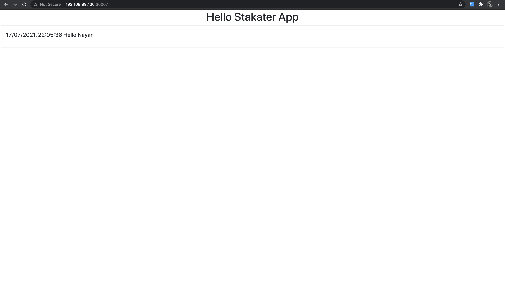

# How to run this application in K8

### Table of contents
1. [Helm backend and frontend deployment](https://github.com/nayankakati/stakater-assigment#helm-deployment)
2. [Backend Service traditional](https://github.com/nayankakati/stakater-assigment#backend-service-deployment)
3. [Frontend Service traditional](https://github.com/nayankakati/stakater-assigment#frontend-service-deployment)


### Pre-requisites
1. Docker installed
2. Minikube installed and running
3. Kubernetes
4. helm installed


### helm-deployment
1. To build the backend service go to [backend build](https://github.com/nayankakati/stakater-assigment/blob/main/stakater-backend/README.md) 
2. To build the frontend service go to [frontend build](https://github.com/nayankakati/stakater-assigment/blob/main/stakater-frontend/README.md)


3. To deploy using helm chart backend service go to [backend-service](https://github.com/nayankakati/stakater-assigment/tree/main/stakater-backend/kubernetes-deployment)
Run the following command
```bash
$ helm install stakater-backend ./helm
```
Output
```
nayan@Nayans-MBP kubernetes-deployment % helm install stakater-backend ./helm
NAME: stakater-backend
LAST DEPLOYED: Sat Jul 17 22:58:33 2021
NAMESPACE: default
STATUS: deployed
REVISION: 1
TEST SUITE: None
```

4. To deploy using heml chart the frontend service go to [frontend-service](https://github.com/nayankakati/stakater-assigment/tree/main/stakater-frontend/kubernetes-deployment)
Run the following command
```bash
$ helm install stakater-frontend ./helm
```
Output

```bash
nayan@Nayans-MBP kubernetes-deployment % helm install stakater-frontend ./helm
NAME: stakater-frontend
LAST DEPLOYED: Sat Jul 17 22:58:10 2021
NAMESPACE: default
STATUS: deployed
REVISION: 1
TEST SUITE: None
```

5. To upgrade the versions
```bash
$ helm upgrade stakater-backend ./helm
$ helm upgrade stakater-frontend ./helm
```
6. To uninstall the heml charts deployment
```bash
$ helm uninstall stakater-frontend
$ helm uninstall stakater-backend
```


### Backend service deployment
1. To build the backend service go to [backend build](https://github.com/nayankakati/stakater-assigment/blob/main/stakater-backend/README.md) 
2. To deploy the backend service go to [backend service repo](https://github.com/nayankakati/stakater-assigment/tree/main/stakater-backend/kubernetes-deployment)

3. Run the deployment file
```bash
$ kubectl apply -f deployment.yml
```
This should create the backend service pod and its corresponding service
```bash
nayan@Nayans-MBP kubernetes-deployment % kubectl apply -f deployment.yml
deployment.apps/stakater-backend created
service/stakater-backend-service created
```
To check whether the pods are running
```bash
nayan@Nayans-MBP kubernetes-deployment % kubectl get pods -o wide
NAME                               READY   STATUS    RESTARTS   AGE   IP           NODE
stakater-backend-c6dd8b5dc-x8klp   1/1     Running   0          14s   172.17.0.4   minikube
```

To check the services output
```bash
nayan@Nayans-MBP kubernetes-deployment % kubectl get services -o wide
NAME                       TYPE        CLUSTER-IP      EXTERNAL-IP   PORT(S)    AGE   SELECTOR
kubernetes                 ClusterIP   10.96.0.1       <none>        443/TCP    2d    <none>
stakater-backend-service   ClusterIP   10.101.189.44   <none>        8080/TCP   3m    app=stakater-backend
```
4. Port forward in a separate tab
Run the following for backend service so that traffic is routed internally.
We can also use LoadBalancer IP
```bash
nayan@Nayans-MBP stakater-backend % kubectl port-forward service/stakater-backend-service 8080:8080
Forwarding from 127.0.0.1:8080 -> 8080
Forwarding from [::1]:8080 -> 8080
```

### Frontend service deployment
1. To build the frontend service go to [frontend build](https://github.com/nayankakati/stakater-assigment/blob/main/stakater-frontend/README.md)
2. To deploy the frontend service go to [frontend service repo](https://github.com/nayankakati/stakater-assigment/tree/main/stakater-frontend/kubernetes-deployment) 
 
3. Run the deployment file
```bash
$ kubectl apply -f deployment.yml
```
This should create the frontend service pod and its corresponding service

```bash
nayan@Nayans-MBP kubernetes-deployment % kubectl apply  -f deployment.yml
deployment.apps/stakater-frontend created
service/stakater-frontend-service created
```

To check whether the pods are running
```bash
nayan@Nayans-MBP kubernetes-deployment % kubectl get pods -o wide
NAME                                 READY   STATUS    RESTARTS   AGE   IP           NODE
stakater-frontend-84ff5d74b8-n7ttd   1/1     Running   0          6m    172.17.0.5   minikube
```

To check the services output
```bash
nayan@Nayans-MBP kubernetes-deployment % kubectl get services
NAME                        TYPE        CLUSTER-IP      EXTERNAL-IP   PORT(S)          AGE
kubernetes                  ClusterIP   10.96.0.1       <none>        443/TCP          2d
stakater-frontend-service   NodePort    10.102.82.83    <none>        3000:30007/TCP   6m
```


4. To hit the frontend page run the following command
```bash
$  minikube service stakater-frontend-service --url
```
```bash
nayan@Nayans-MBP kubernetes-deployment % minikube service stakater-frontend-service --url
http://192.168.99.100:30007
```

5. Output 


